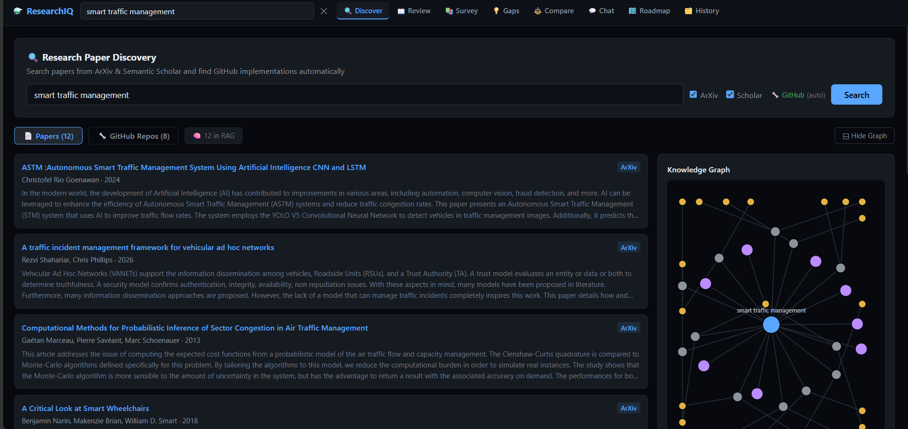
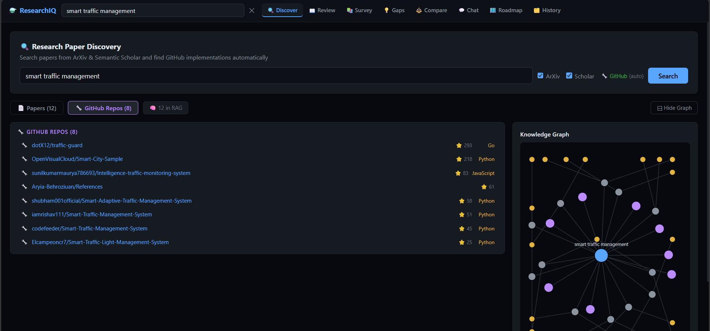
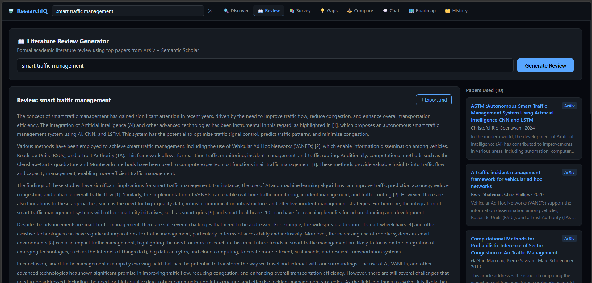
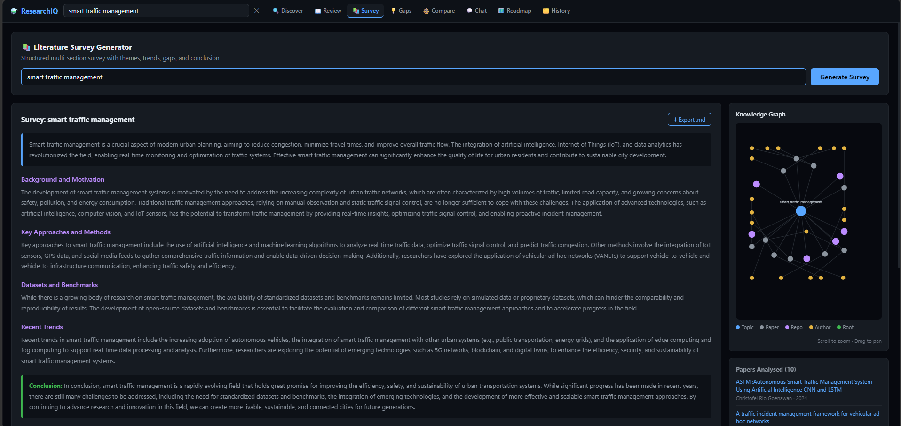
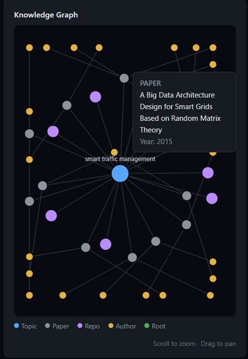
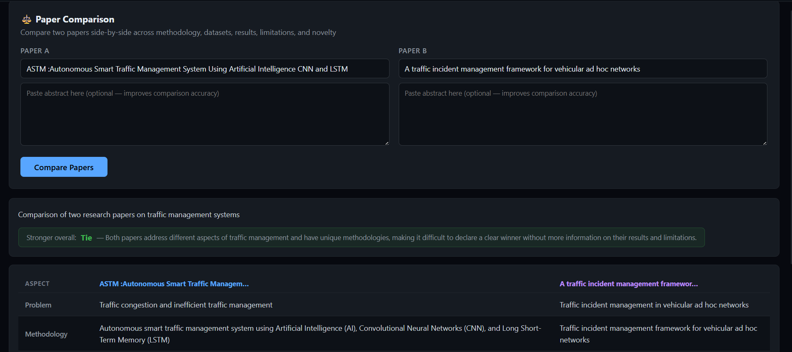
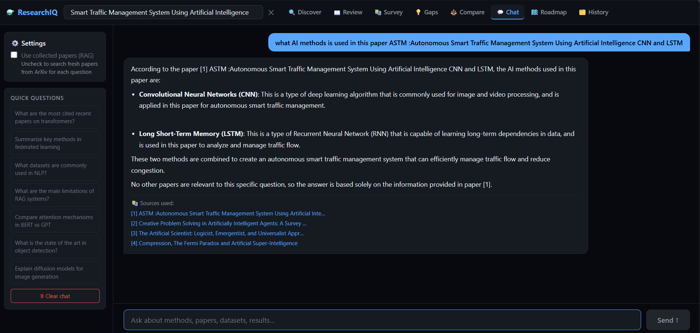

# 🔬 ResearchIQ —MCP-Powered Research Intelligence Platform


ResearchIQ is a MCP-powered Research Intelligence Platform that enables researchers, students, and developers to discover, analyze, compare, and understand academic literature using AI.

The platform leverages the **Model Context Protocol (MCP)** to connect Large Language Models with external research systems such as **ArXiv**, **Semantic Scholar**, and **GitHub**, allowing the AI agent to retrieve real-time research knowledge before generating insights.

By combining MCP servers, Retrieval-Augmented Generation (RAG), Knowledge Graphs, and Groq-powered LLMs, ResearchIQ transforms scattered research information into actionable intelligence through a single unified interface.

---

# 🚀 Features

### 🔍 Multi-Source Research Discovery

Search across multiple research ecosystems simultaneously:

* ArXiv
* Semantic Scholar
* GitHub Repositories

Features:

* Parallel retrieval
* Paper deduplication
* Metadata enrichment
* Repository discovery
* Unified search experience

---

### 🔌 MCP-Powered Tool Calling

ResearchIQ uses MCP servers to expose external research systems as AI-accessible tools.

Connected MCP Servers:

| MCP Server           | Purpose                              |
| -------------------- | ------------------------------------ |
| ArXiv MCP            | Research paper discovery             |
| Semantic Scholar MCP | Citation and metadata retrieval      |
| GitHub MCP           | Open-source implementation discovery |

Benefits:

* Real-time information retrieval
* Tool-augmented reasoning
* Reduced hallucinations
* Source-grounded outputs
* Extensible architecture

---

### 📚 Literature Review Generator

Automatically generates structured academic literature reviews.

Outputs include:

* Research Background
* Existing Approaches
* Comparative Analysis
* Key Findings
* Limitations
* Future Directions

Powered by Groq Llama 3.3 70B.

---

### 📝 Research Survey Generator

Create comprehensive surveys covering:

* Introduction
* Background
* State of the Art
* Key Methods
* Datasets
* Evaluation Metrics
* Current Trends
* Conclusion

---

### 🎯 Research Gap Detection

Identify:

* Underexplored problems
* Missing evaluations
* Dataset limitations
* Novel opportunities
* Future research directions

---

### 🌐 Interactive Knowledge Graph

Visualize relationships among:

* Papers
* Authors
* Topics
* Citations
* Repositories

Built using D3.js and NetworkX.

---

### ⚖️ Paper Comparison Engine

Compare research papers across:

* Problem Statement
* Methodology
* Dataset
* Results
* Novel Contributions
* Limitations

Ideal for literature analysis and academic reviews.

---

### 💬 Chat with Papers

Ask natural language questions about research papers.

Capabilities:

* Context-aware responses
* Paper-grounded reasoning
* Research assistance
* Citation-based answers

Powered by Retrieval-Augmented Generation (RAG).

---

### 🗺️ Research Roadmap Generator

Generate personalized learning roadmaps:

1. Foundations
2. Core Concepts
3. Advanced Topics
4. Research Contributions

Includes relevant papers and implementation repositories.

---

### 🗄️ Research History

Stores:

* Searches
* Literature Reviews
* Surveys
* Gap Reports
* Learning Roadmaps

using SQLite persistence.

---

# 🎯 Why MCP?

Traditional AI research assistants rely on static model knowledge and quickly become outdated.

ResearchIQ adopts the **Model Context Protocol (MCP)**, enabling AI agents to interact with live research systems as external tools.

Benefits of MCP:

✅ Real-time paper retrieval

✅ Access to latest publications

✅ Citation-aware reasoning

✅ Repository discovery

✅ Extensible architecture

✅ Reduced hallucinations

✅ Research-grounded outputs

This makes ResearchIQ a true AI research copilot rather than a simple paper summarization system.

---

# 🏗️ MCP Architecture

```text
                          User Query
                               │
                               ▼

                  ┌─────────────────────┐
                  │    React Frontend   │
                  └──────────┬──────────┘
                             │
                             ▼

                  ┌─────────────────────┐
                  │   FastAPI Backend   │
                  └──────────┬──────────┘
                             │
                             ▼

                  ┌─────────────────────┐
                  │ Research AI Agent   │
                  │ Groq Llama 3.3 70B  │
                  └──────────┬──────────┘
                             │

        ┌────────────────────┼────────────────────┐
        │                    │                    │
        ▼                    ▼                    ▼

 ┌───────────────┐   ┌───────────────┐   ┌───────────────┐
 │   ArXiv MCP   │   │ Semantic MCP  │   │  GitHub MCP   │
 │    Server     │   │    Server     │   │    Server     │
 └───────┬───────┘   └───────┬───────┘   └───────┬───────┘
         │                   │                   │
         ▼                   ▼                   ▼

     Research          Citation Data      Open Source
      Papers             Metadata      Implementations

         └───────────────┬────────────────┘
                         ▼

                ┌──────────────────┐
                │ Context Builder  │
                └────────┬─────────┘
                         │

        ┌────────────────┴────────────────┐
        ▼                                 ▼

 ┌─────────────────┐             ┌─────────────────┐
 │ Knowledge Graph │             │    RAG Store    │
 │   (NetworkX)    │             │ Context Engine  │
 └────────┬────────┘             └────────┬────────┘
          │                               │
          └──────────────┬────────────────┘
                         ▼

                ┌──────────────────┐
                │ Insight Engine   │
                └────────┬─────────┘
                         ▼

       Reviews • Surveys • Gaps • Chat • Roadmaps
```

---

# 🔄 Research Workflow

```text
Research Topic
      │
      ▼
MCP-Based Paper Discovery
(ArXiv + Semantic Scholar + GitHub)
      │
      ▼
Aggregation & Deduplication
      │
      ▼
Knowledge Graph Construction
      │
      ▼
RAG Context Creation
      │
      ▼
Groq LLM Analysis
      │
      ▼
Review / Survey / Gap Detection
      │
      ▼
SQLite Persistence
      │
      ▼
Interactive Insights
```

---

# 📸 Screenshots

## 🏠 Research Discovery



---

## 📦 GitHub Repository Discovery



---

## 📚 Literature Review Generator



---

## 📄 Research Survey Generation



---

## 🌐 Knowledge Graph Visualization



---

## ⚖️ Paper Comparison



---

## 💬 Chat with Papers



---

# 🛠️ Tech Stack

| Component        | Technology                      |
| ---------------- | ------------------------------- |
| Frontend         | React, Vite                     |
| Backend          | FastAPI                         |
| Language         | Python                          |
| LLM              | Llama 3.3 70B                   |
| Inference        | Groq                            |
| Protocol         | Model Context Protocol (MCP)    |
| Knowledge Graph  | NetworkX                        |
| Visualization    | D3.js                           |
| Database         | SQLite                          |
| APIs             | ArXiv, Semantic Scholar, GitHub |
| Async Processing | aiohttp                         |
| Validation       | Pydantic                        |
| RAG Engine       | Custom Context Retrieval        |

---

# 📂 Project Structure

```text
research-intelligence-platform/
│
├── backend/
│   ├── app/
│   │   ├── api/
│   │   ├── agents/
│   │   ├── mcp/
│   │   │   ├── arxiv.py
│   │   │   ├── semantic_scholar.py
│   │   │   └── github.py
│   │   │
│   │   ├── services/
│   │   ├── rag/
│   │   └── db/
│   │
│   └── requirements.txt
│
├── frontend/
│   ├── src/
│   │   ├── components/
│   │   ├── pages/
│   │   └── services/
│   │
│   └── package.json
│
├── screenshots/
│   ├── home-discover.png
│   ├── github-repo-discover.png
│   ├── literature-review-generator.png
│   ├── survey.png
│   ├── graph.png
│   ├── paper-compare.png
│   └── chat.png
│
├── data/
├── run.py
├── README.md
├── .env.example
└── .gitignore
```

---

# ⚙️ Installation

## 1️⃣ Clone Repository

```bash
git clone https://github.com/YOUR_USERNAME/research-intelligence-platform.git

cd research-intelligence-platform
```

---

## 2️⃣ Create Virtual Environment

### Windows

```bash
python -m venv venv

venv\Scripts\activate
```

### Linux / macOS

```bash
python3 -m venv venv

source venv/bin/activate
```

---

## 3️⃣ Install Backend Dependencies

```bash
pip install -r backend/requirements.txt
```

---

## 4️⃣ Install Frontend Dependencies

```bash
cd frontend

npm install

npm run build

cd ..
```

---

## 5️⃣ Configure Environment Variables

Create a `.env` file:

```env
GROQ_API_KEY=your_groq_api_key
GITHUB_TOKEN=optional
```

Get a free API key from:

https://console.groq.com

---

## 6️⃣ Run the Application

```bash
python run.py
```

Open:

```text
http://127.0.0.1:8000
```

---

# 💡 Example Use Cases

```text
Generate a literature review on Retrieval-Augmented Generation
```

```text
Find research gaps in Multimodal Large Language Models
```

```text
Compare Vision Transformers and CNN-based architectures
```

```text
Generate a survey on Graph Neural Networks
```

```text
Create a research roadmap for Reinforcement Learning
```

```text
Find GitHub implementations related to Diffusion Models
```

---

# 🎯 Future Enhancements

* Persistent Vector Database
* Citation Network Analysis
* PDF Research Assistant
* Multi-Agent Research Workflows
* Zotero Integration
* CrossRef MCP Integration
* PubMed MCP Integration
* Semantic Search
* BibTeX Export
* LaTeX Report Generation
* Research Recommendation Engine

---

# 👩‍💻 Author

**Raveena V**

B.Tech Computer Science and Engineering

VIT Chennai

---

⭐ If you found this project useful, consider giving it a star.
